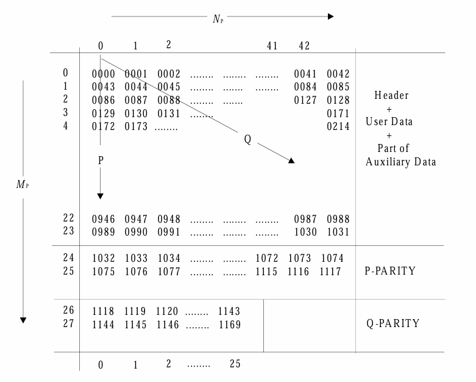

## Description
A Node.js implementation for calculating ECC for CD-ROMs, supports PCE-CD, Sega Saturn, and other Mode 1 CD-ROMs.

## Usage
```javascript
const fs = require('fs')
const { getECC } = require('./ecc')

const buffer = fs.readFileSync('sector.bin')
const eccBuffer = getECC(buffer)  // input buffer: 2532-byte sector data

// Note that the ECC calculation always depends on the correct EDC value in the given sector.
// Therefore, if the EDC in the sector has not been calculated, it should be computed and set first.
```

## CD-ROM 的结构

一般我们从网上下载的光盘分为 `cue` 和 `iso/bin/img` 文件，后者就是 CD-ROM 主体，文件中每 2352 字节一个扇区，每个 `iso/bin/img` 文件是多个扇区组成，即 2352 * N

一个扇区的结构：
```
2352 = 12 + (3 + 1) + 2048 + 4 + 8 + (172 + 104)
```

- Sync field：固定为 00 FF FF FF FF FF FF FF FF FF FF 00 的 12 个字节
- Header field
    - Sector Address：3 个字节，代表 MIN，SEC 和 FRAC，即分秒帧，简称 MSF。1 分钟 = 60  秒，1 秒 = 75 帧
    - Mode：1 个字节，可以是 00，01，02，三个不同的模式影响后面的数据结构
        - 00 的时候后面的字节全为 00
        - 02 的时候后面的字节全为 User Data
        - 01 最复杂
        
        因为 PCE-CD 的 Mode 总是为 01，所以后面讨论的都是 Mode 为 01 时的结构
        
- User Data：2048 个字节代表用户数据
- EDC field：4 个字节的校验码，用 CRC32 对前 (12 + 4 + 2048 =) 2064 个字节用 `P(x) = (x^16 + x^15 + x^2 + 1) . (x^16 + x^2 + x + 1)` 算出
- Intermediate field：8 个 00
- ECC field：276 字节的纠错码
    - P-Parity field：172 个字节
    - Q-Parity field：104 个字节

## RSPC 算法

ECC 的 276 个字节就是用 RSPC 算出来的，它由 P-Parity 和 Q-Parity 两部分组成

RSPC = Reed Solomon Product Code，又称**二维 RS 码**，它把数据看作二维结构，分别沿着行方向和列方向计算一组 P-Parity 和 Q-Parity

```
       行方向（P-Parity）→
+----------------------------------+
| D D D D D D D D D D D D P1 P2   |
| D D D D D D D D D D D D P1 P2   |  Q-Parity
| D D D D D D D D D D D D P1 P2   |     ↓
| D D D D D D D D D D D D P1 P2   |
+----------------------------------+
               ↓
             Q1  Q2
```

理论是这样，但在 CD-ROM 的实际设计中，P-Parity 是沿着垂直方向，而 Q-Parity 是沿着对角线方向计算的

CD-ROM 中，输入 RSPC 的字节是跳过前 12 个同步字节后的 2064 个字节，它包括 4 字节的 Header 区，2048 字节的用户数据，4 字节的 EDC 和 8 字节 00

## P-Parity

P-Parity 的对象是前 (4 + 2048 + 4 + 12 = ) 2064 个字节，对应 1032 个 WORD（小端序，即右边在前），1032 = 24 * 43，即 24 行 43 列 WORD



P-Parity 是按列生成，对每列的 24 个 WORD 使用 RS(26, 24) 算法生成 2 个 WORD，43 列每列如此，得到 26 行 43 列 WORD

流程是：

- Data = 0000 0043 0086 0129 0172 … 0946 0989 ⇒ RS(26, 24) => Code = 1118 1144
- Data = 0001 0044 0087 0130 0173 … 0947 0990 ⇒ RS(26, 24) => Code = 1033 1076

…

- Data = 0042 0085 0128 0171 0214 … 0988 1031 ⇒ RS(26, 24) => Code = 1074 1117

如果以 0 为行和列编号的起点，那么第 i 组第 j 个元素的编号

```bash
N = i + 43 * j
```

比如第 42 组第 3 个是 N = 42 + 43 * 3 = 171

结果多了 2 行 43 列的 WORD，对应 86 个 WORD，172 字节

## Q-Parity

Q-Parity 的对象是前 (4 + 2048 + 4 + 12 + 172 = ) 2236 个字节，对应 1118 个 WORD，1118 = 26 * 43

简单讲，就是 P-Parity 的对象加上新增的 P-Parity 纠错码本身

Q-Pariy 处理 26 行 43 列 WORD

它按对角线的方向读 26 组对角线数据，每组 43 个元素


的流程是：

- Data = 0000 0044 0088 … 0642 0686 0730 ⇒ RS(45, 43) => Code = 1118 1144
- Data = 0043 0087 0131 … 0685 0729 0773 ⇒ RS(45, 43) => Code = 1119 1145

…

- Data = 1075 0001 0045 … 0599 0643 0687 ⇒ RS(45, 43) => Code = 1143 1169

规律就是

- 第 n 条对角线总是从第 n 行第 1 列开始，一共有 26 行所以一共 26 组数据
- 每组数据往右下角访问下一个元素，下方抵达边界时回到第 1 行

如果以 0 作为行和列编号的起点，那么第 i 组第 j 个元素的序号是：

```bash
N = (i * 43 + j * 44) % 1118
```

比如，第 20 行第 40 个元素是 N = (20 * 43 + 40 * 44) % 1118 = 470

---

26 条对角线，每条对角线的 43 个元素用 RS(45, 43) 扩展 2 个元素

一共多了 26 * 2 = 52 个元素，1 个元素 2 字节，所以多了 104 字节，这就是 Q-Parity 的纠错码

## 细节

实际计算的时候，会发现一个奇怪的问题，P-Parity 是 RS(26, 24) 处理，基本单位 G(2^8) 对应一个字节，但是我们实际上拿到的输入是 24 个 WORD，不是预期的 24 字节扩展 26 字节

仔细观察上文可知，虽然我们输入的是 24 个 WORD，但预期生成的也是 2 个 WORD，数量对得上

本质是把每个 WORD 拆成 MSB 和 LSB 两个字节，24 个 WORD 对应的 24 个 MSB 字节用 RS(26, 24) 生成 2 个字节，24 个 LSB 字节同样生成 2 个字节，这 4 个字节就组成了 2 个 WORD

## 举例

以 **Tokimeki Mahjong Graffiti - Toshishita no Tenshi-tachi (Japan) (Track 01).bin** 为例，这是一段扇区

```bash
# 这是同步字节
00 FF FF FF FF FF FF FF FF FF FF 00
# 这是 Header 字节
00 02 01 01

# 这是用户数据区
1E E1 64 4C 48 4C 48 4C 3A 84 C2 24 84 C1 23 9E
18 1A 33 44 1A 34 57 98 34 79 D2 79 DC E1 64 44
44 44 4F 1E E1 64 44 44 44 4F 1E E1 64 44 4C 2D
14 C2 D1 4C 2D 14 C1 2D 14 C0 24 E1 91 A3 34 01
24 45 79 14 47 9D 14 79 D3 7D 5E 16 44 44 44 44
F1 EE 16 44 44 44 44 F1 EE 16 44 44 44 C0 D3 4C
0D 34 C0 D3 4C 0D 34 E3 FA E1 16 A3 44 C0 B3 57
98 0B 37 9D 1B 39 D3 57 D4 3D 5C E4 44 3A 6C 0D
09 75 3B 0D 29 73 BD 49 3D 57 D6 E2 66 C5 5C 53
AE 46 B4 79 D0 06 37 9D 10 25 9D 21 39 D3 A5 D4
57 D3 93 9D 37 3D 39 5F 11 97 55 58 95 55 79 89
55 7D 25 7D 45 D5 7F 15 55 55 55 55 F3 65 55 55
55 5F 27 4C 0B 37 D0 40 12 59 85 46 A3 7D 14 12
59 D1 4A 37 D2 42 49 D2 44 49 D2 44 4F 17 97 5D
27 55 7D 17 57 9D 19 57 D3 75 9D 35 7F 12 55 55
55 55 9F 35 55 55 55 55 F2 94 02 47 D1 41 45 95
55 42 47 D2 45 49 D2 44 5D 34 47 D3 44 9D 34 4F
17 97 D3 75 5D 27 57 9D 19 57 D3 75 9D 35 7F 11
55 55 55 55 79 F3 45 55 55 55 5F 2B 4C 0D 34 C0
55 55 54 C0 D3 4C 0D 34 C0 D3 4C 0D 34 C0 D3 4C
66 3C 4A 5C 36 37 C3 A3 8C 35 78 C2 63 98 C2 A5
D0 C2 57 D0 7D 47 D4 74 D4 49 D3 75 D4 57 D4 4D
47 5D 45 7D 04 7D 49 47 D4 94 D5 57 D4 75 D5 4D
55 7D 47 5D 17 36 C3 85 AC 38 73 6C 2D 03 AC 2D
07 5C 2D 09 36 C1 D1 5A C1 D1 75 E4 13 D3 75 3D
37 53 D3 75 3D 39 53 9D 37 57 D3 9A 5D 41 39 D3
9D B5 59 D5 7D 55 D5 57 D4 95 57 D3 95 55 79 D7
55 55 55 54 D3 99 7F 2E 44 44 44 44 55 44 44 44
89 75 44 44 D1 97 44 4D 37 44 D4 74 D4 95 84 44
D2 44 44 D2 44 44 D2 44 44 D2 44 44 D2 44 44 D2
44 44 D2 44 44 D4 39 D4 4D 54 D5 4D 54 D5 4D 54
D5 4D D5 55 55 5F 36 55 55 55 55 F3 14 4D 15 55
44 D1 44 44 4D 14 44 44 D1 44 44 4D 14 44 44 D1
44 44 4D 14 44 44 D4 49 D4 4D 54 D5 4D 54 D5 4D
54 D5 4D C4 55 55 5D 04 D5 4D 54 D5 4D 54 D5 4D
B5 55 55 55 5F 33 4C 05 55 55 4C 0D 34 C0 D3 4C
0D 34 C0 D3 4C 0D 34 C0 D3 4C 36 3D 1C 1A 5D 1C
15 7D 1C 06 3D 2C 0A 5D 2C 05 7D 20 63 D3 0A 5D
74 D4 75 D4 57 D4 4D 47 5D 45 7D 44 D4 75 D7 4D
55 7D 47 5D 54 D5 57 D4 75 D5 4D 55 7D 23 6C 0D
25 AC 0D 27 5C 0D 33 60 D3 5A 0D 37 50 D4 36 D4
5A E3 F2 5D 30 63 7D 2C 0B 47 D1 C1 B4 7D 0C 2B
47 9C 36 23 C5 14 44 44 44 4D 19 75 55 F1 E7 99
D3 25 57 9D 14 44 55 55 55 55 55 79 D1 97 55 55
D4 75 F1 E5 55 5D 97 9D 49 59 D4 75 9D 45 7D 47
59 D3 95 7D 45 7D 24 44 4D 25 44 4D 27 44 4D 29
44 4D 35 44 D3 54 4D 35 44 D3 54 4D 44 55 55 5D
04 D5 4D 54 D5 4D 54 D5 4D 54 D3 55 55 55 55 F3
05 55 55 55 55 55 55 5F 2E 55 55 55 55 44 44 4D
14 44 44 D1 44 44 4D 14 44 44 D1 44 44 4D 14 44
44 D1 44 44 4D 15 55 44 D4 4D 54 D5 4D 54 D5 4D
54 D5 4D 54 D4 45 55 55 D0 4D 54 D5 4D 54 D5 4D
54 D5 45 55 55 55 55 55 4D 54 D5 4D 54 D5 4D 54
D5 4D 54 D4 4C 0D 34 C0 D3 4C 0D 34 C0 D3 40 6D
34 0A D3 40 5D 34 63 05 7D 36 3D 4A 5D 45 7D 43
D5 5D 47 7D 45 D5 48 57 D4 4D 47 5D 45 7D 44 D4
75 D4 57 D4 4D 47 4D 47 57 D4 45 D4 54 D4 74 7D
44 5D 44 4D 44 47 D9 75 D5 37 D4 55 D4 74 D5 57
D4 75 D5 4D 4C 66 C5 AC 55 C5 36 C4 5A C4 75 C4
83 6C 34 D5 4D 54 D5 4D 54 D5 4D 54 55 55 55 54
F3 55 55 55 55 5F 2C 75 D1 97 55 55 55 55 79 D8
95 7D 37 59 D3 57 D3 75 9D 35 9D 49 D4 7D 49 5D
39 73 85 44 D3 54 4D 29 34 49 D1 75 24 9D 13 2A
37 D1 31 12 59 D0 26 6A 37 D0 6C 01 25 9D 14 9D
45 7D 47 59 D3 95 7D 47 57 9D 37 55 7D 39 75 F2
E9 D5 55 55 55 55 F3 65 55 55 55 5D 94 4D 44 4D
44 49 D3 44 7D 34 45 D3 45 49 85 55 42 47 D2 41
45 9D 14 9D 45 7D 47 59 D3 95 7D 47 57 9D 37 55
D4 97 F2 E7 9D 45 55 55 55 5D C4 D5 4D 54 D5 4D
54 D5 48 55 55 55 4D C4 A5 D3 35 7D 33 3D 43 5D
43 7D 43 D5 5D 57 D6 75 D4 57 D4 4D 47 5D 45 7D
44 D4 75 D4 57 F1 57 D5 5D 54 D4 74 D4 54 55 D2
44 F3 05 55 55 55 5D 75 7D 47 5D 54 D5 57 D4 75
D5 4D 25 55 47 DA 5A C3 87 5C 3D 03 6C 2D 05 AC
2D 07 5C 2D 13 6C 1D 15 AC 1D 17 5C 14 D5 4D 54
D5 4D 54 D5 44 44 44 44 CE F2 64 44 44 44 4C EF
1D 9D 29 75 34 44 44 35 2C ED 29 74 BD 19 74 B0
D0 75 4B C0 75 32 1C 13 2B C3 6E 19 B3 78 C3 23
9C 42 4C 5A E1 ED E7 9D 43 47 9D 21 A3 45 79 8C
01 A3 34 4C EF 26 44 44 44 44 CE F2 64 44 44 44
4C ED 14 02 47 D1 4C 02 4D 14 C1 2D 14 C2 D1 4C
24 44 4E 12 D6 7D 54 79 D3 14 47 9D 10 12 44 57
9C 11 A3 34 CE F2 64 44 44 44 4C EF 26 44 44 44
44 CE F2 64 44 44 44 4C ED 24 D4 75 D4 57 D4 4D
47 5D 24 44 44 44 4C ED 17 44 D3 54 4D 34 44 D2
74 44 D2 54 44 D0 44 44 44 44 CE F2 64 44 44 44
4C EF 26 44 44 44 44 CE D2 46 C0 D2 5A C0 D2 75
C0 D3 46 0D 34 A0 44 44 44 5E 0F 09 D1 0D 20 0A
62 12 21 1A 22 28 89 00 D1 0B 61 12 41 0B 00 09
20 0A 21 1A 22 2A 23 3A 40 1E 24 4A 25 5A 26 6A
40 2A 27 7A 28 8A 29 9A 00 28 2A AA 2B BA 2C CA
2D DA 2E EA A0 24 40 0E 00 00 05 EC 20 20 20 20
43 4F 50 59 52 49 47 48 54 28 43 29 20 53 45 47
41 20 45 4E 54 45 52 50 52 49 53 45 53 2C 4C 54
44 2E 20 31 39 39 34 20 41 4C 4C 20 52 49 47 48
54 53 20 52 45 53 45 52 56 45 44 20 20 20 20 20
A0 0E 00 09 46 6F 72 20 4A 41 50 41 4E 2E 20 20
20 20 20 20 20 20 20 20 20 20 20 20 20 20 20 20
D7 08 D5 07 67 72 63 52 C7 1B 20 32 C7 06 61 73
E2 15 64 06 42 10 21 42 8F FB 71 04 A0 30 25 72
06 00 02 DC 06 00 02 60 93 20 E0 10 23 00 DF 11
D1 11 E0 01 2F 76 E4 03 4F 22 41 0B 23 00 4F 26
D5 0B E3 FE 25 31 90 0F 81 58 E0 00 81 5A 81 5C
81 5E 97 0A 60 51 C8 01 8B 01 47 10 8B FA 85 58
85 5A 85 5C 00 0B 85 5E 60 00 09 00 FE 92 00 09
25 89 00 08 06 00 20 00 00 00 00 00 00 00 00 00
4F 22 D0 17 60 01 C9 01 20 08 89 02 93 24 A0 01
00 09 93 22 63 3F D2 13 22 31 63 3F 91 1E 33 1C
63 3F D2 11 22 31 D3 11 63 32 D5 11 E4 40 43 0B
00 09 D2 0E 62 22 D5 0F E4 41 42 0B 00 09 D3 0E
63 32 E5 00 E4 FC 43 0B 00 09 B0 F8 00 09 E2 00
D3 0A 23 21 A0 23 00 09 00 FF 00 DF 50 00 FF FF
25 F8 00 04 06 00 32 C4 06 00 32 C6 06 00 03 00
06 00 30 74 06 00 30 82 06 00 03 44 06 00 32 BA
B0 CB 00 09 B1 18 00 09 B0 FB 00 09 D4 1A 64 41
B1 1E 00 09 D2 18 62 21 72 01 D3 17 23 21 D2 16
62 21 E3 04 32 33 8B EB B1 7F 00 09 B1 4D 00 09
B1 9C 00 09 D2 11 62 22 E5 03 E4 FF 42 0B 00 09
D3 0F 63 32 E5 00 E4 40 43 0B 00 09 D2 0C 62 22
E5 00 E4 41 42 0B 00 09 D3 0A 43 0B 00 09 4F 26
00 0B 00 09 2F E6 7F F4 1F 42 63 F3 73 06 23 51
2F 62 EE 00 A0 10 00 09 06 00 32 BA 06 00 03 44
06 00 03 00 06 00 40 00 52 F2 72 02 1F 22 72 FE
85 F3 63 03 22 31 7E 02 63 F2 3E 33 8B F4 7F 0C
6E F6 00 0B 00 09 2F E6 7F F4 1F 42 1F 51 2F 62
EE 00 A0 0B 00 09 52 F2 72 02 1F 22 72 FE 53 F1
73 02 1F 31 73 FE 61 31 22 11 7E 02 63 F2 3E 33
8B F1 7F 0C 6E F6 00 0B 00 09 2F E6 7F F4 1F 42

# 这是 EDC 编码以及固定 8 个 00
E5 FA 31 CB
00 00 00 00 00 00 00 00

# 这是 P-Parity 编码
68 94 90 1C 40 6F 98 AD 22 66 1A 21 5A 1B 45 75
03 42 F3 F8 60 B9 D0 B9 14 9C BD 66 56 B2 5B E4
7E 39 1C 22 2A 76 C5 18 8D BB 62 AB E5 81 52 12
12 30 1D 2F 28 87 A1 E2 90 BD E4 94 7A 78 80 07
CC 72 67 52 5C CD 0C CE 76 24 94 44 A9 01 09 37
D5 6D 54 0A 34 6E 24 7E 22 F5 ED B4 F6 01 1E A3
28 FD 6F 44 5B F1 5A DE 2C 4A 0B 70 BD B5 0D 4B
13 BD D3 B2 9F CD B7 79 42 05 EE 18 73 A3 39 27
25 58 7F 38 FA 9F EA 8E 6D 4C 07 33 0F 7F 1B 3F
19 FE CC 23 62 AF 6B E1 33 3A 9A 8E AC 4A E7 EE
5A 6C 43 1E CA 38 E2 FF 37 DC 19 9B

# 这是 Q-Parity 编码
E7 8F 04 D5 46 A3 AA 1A 40 B8 4F 9B 6E 25 9A 55
E4 B3 E7 32 24 63 85 01 69 41 77 DA 7A 81 16 C2
82 5C D4 2F 54 2F 5F E4 AF FC 7E 56 58 48 A5 DE
04 D0 51 DF 30 3D E1 AB 07 DE C8 C4 C7 58 33 1F
94 98 BB 32 74 0F F8 21 D6 05 AC C7 7D 68 DD DC
7A F4 AD 95 69 33 18 F9 15 F9 F2 F8 77 55 67 71
7D 1C 5D DB 6B 14 89 64
```

---

### P-Parity 的计算

输入是：跳过前 12 字节，从 `00 02 01 01` 开始，到 `E5 FA 31 CB 00 00 00 00 00 00 00 00` 为止，读取 2064 个字节作为输入

可以列一个表格

| 组别 | 位置 | 输入 | 输出 |
| --- | --- | --- | --- |
| 0 | LSB | 00 16 11 45 7D 57 44 0A 55 55 D3 75 D3 35 D5 4C 64 2E 4A 4F 63 32 D3 7E | 68 24 |
| 0 | MSB | 02 44 97 95 47 D3 D1 5D F1 55 4C C4 95 7D 4D 02 44 EA 41 26 3F C6 0F 02 | 94 7E |
| 1 | LSB | 01 44 55 55 D4 95 44 2C E7 55 0D 83 7D 33 54 4D 44 A0 50 D5 D2 06 63 63 | 90 22 |
| 1 | MSB | 01 44 58 42 74 55 44 05 99 55 34 6C 47 3D D5 14 44 24 41 0B 13 00 32 F2 | 1C F5 |
| 2 | LSB | 1E 44 95 47 D4 79 4D 7D D3 55 C0 34 57 43 44 C1 4C 40 4E E3 22 03 E5 3E | 40 ED |
| 2 | MSB | E1 F1 55 D2 49 D7 14 20 25 5F D3 D5 9D 5D 44 2D EF 0E 2E FE 31 00 00 33 | 6F B4 |
| … |  |  |  |
| … |  |  |  |
| 42 | LSB | F1 39 D1 57 D4 15 3D 19 05 34 5A 47 A5 4D 47 CE 2D 72 23 93 06 00 22 00 | 34 19 |
| 42 | MSB | EE 5F 41 D0 95 55 2C 75 55 C0 C4 59 D3 54 D1 F2 DA 20 00 22 00 09 31 00 | 6E 9B |

如表，我们把 2064 字节按 86 字节 86 字节地分，一共 24 块，第 1 块的 86 字节 `00 02 01 01 1E E1 … F1 EE` 按竖方向填充表格的输入列的第 1 个元素，第 2 块的 86 字节填充输入列第 2 个元素，…，遍历完 2064 字节，表格的输入列也就完成了

对每个输入列，用 RS(26, 24) 算出 2 个纠错码，填入输出列

最后每个输出列看成 2 个竖行 `68 94 90 1C 40 6F … 34 6E` 和 `24 7E 22 F5 ED B4 … 19 9B`

2 个竖行拼接到一起就是 172 字节的 P-Parity 编码

---

### Q-Parity 的计算

输入是：P-Parity 的输入 + P-Parity 的输出，一共 2064 + 172 = 2236 字节，从 `00 02 01 01` 开始，到 `19 9B` 为止

可以列一个表格

| 组别 | 位置 | 输入 | 输出 |
| --- | --- | --- | --- |
| 0 | LSB | 00 44 95 45 D4 D3 14 57 D1 44 5D 55 94 57 BD CE D1 54 C7 00 00 D2 73 73 12 6D 14 3D 27 C0 37 4D 0D 0B 04 4D D4 37 54 AC 4C 44 2D | E7 30 |
| 0 | MSB | 02 44 55 49 57 99 44 D4 97 44 45 5F 4D F1 19 F2 0D 45 06 0B 09 18 06 FE 30 4C C2 57 55 D3 53 54 34 47 D5 54 75 D0 D5 1D ED 44 DA | 8F 3D |
| 1 | LSB | 16 55 47 D3 55 44 75 55 44 3D 55 55 75 29 A3 0F 45 20 85 42 00 63 1F 52 EA 4C BD 97 0D 75 39 D3 7D 55 55 D5 26 D5 1D 44 44 2C 72 | 04 E1 |
| 1 | MSB | 44 58 D2 75 54 4D D4 79 D1 4A 55 5D D4 74 34 09 4E 32 5C 0B 09 F3 31 12 8E 2D 49 5D 34 3D D4 4C 2C 5D 55 57 6A 4D 15 44 44 CA 20 | D5 AB |
| 2 | LSB | 11 55 D4 55 D1 74 55 14 7D F3 55 44 2C 9C 44 41 C7 85 E4 B1 1F 73 E5 FA 64 29 4F D3 13 44 34 30 44 55 D4 59 4D 13 64 44 2B 46 23 | 46 07 |
| 2 | MSB | 97 42 49 55 44 D4 55 44 36 55 55 D4 ED 11 5E 20 1B 5A 41 1E 42 02 81 9F 44 73 17 4C D3 D4 C0 63 55 55 74 D0 54 6C 44 D0 BA 6F 00 | A3 DE |
| … |  |  |  |
| … |  |  |  |
| 25 | LSB | 24 01 44 79 D2 D4 7F 44 4D 55 4D 7D 2C 44 57 74 64 20 52 61 85 D3 62 23 61 1D 07 D1 D6 7D 4C D3 D5 C0 D1 4D D5 D5 6C 48 17 14 CE | 51 89 |
| 25 | MSB | 7E 01 F1 89 44 4D 2E D1 47 55 14 43 75 4D D5 B0 44 0A 50 73 5E 0E 21 51 31 2F 33 4C E2 17 0D 75 4D D3 C1 54 4D 4D 01 55 5C 02 F2 | DF 64 |

表中 2236 字节被分配到每个输入字段，由于对角线分配很难用语言描述，改用公式说明：

- 第 i 组的 LSB 的输入向量，第 j 个元素是 `(i * 43 + j * 44) * 2 % 2236`
- 第 i 组的 MSB 的输入向量，第 j 个元素是`(i * 43 + j * 44) * 2 % 2236 + 1`

每个输入向量维度是 43，经过 RS(45, 43) 算 2 个纠错码，填入输出列

同样地，每个输出列看作 2 竖行 `E7 8F 04 D5 46 A3 … 51 DF` 和 `30 3D E1 AB 07 DE 89 64`

2 竖行拼接到一起就是 104 字节的 Q-Parity 编码

---

组合 P-Parity 的 172 字节，和 Q-Parity 的 104 字节，得到的 276 字节就是这个**扇区的 ECC 编码**

它也可以说是扇区**跳过前 12 字节后的 2064 字节作为输入的 RSPC 结果**
